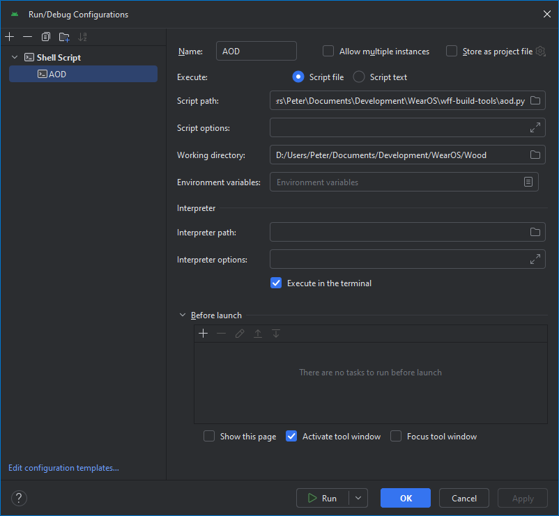

# Watch Face Format Always On Display Assessor

Command-line tool for estimating AOD compliance of [Wear OS Watch Face Format](https://developer.android.com/training/wearables/wff) screenshots or mockups.

## Prerequisites

* A reasonably recent [Python](https://www.python.org/downloads/) installation.

* Python's `pillow` extension (install with `pip install pillow`).

* To capture screenshots using `adb`, the `adb` executable needs to be accessible via the `PATH` environment variable, or via the `ANDROID_HOME` environment variable (in subdirectory `platform-tools`).

## Usage

aod.py aod.py [-h] [-s] [-n] [-b B] [-c] [-v] [source]

    source      filename (.png); if unspecified, capture from adb
    -d          display diagnostic information
    -s          watchface is square (default: round)
    -n          consider all non-black pixels to be fully used
    -b B        bleed factor
    -c          calculate bleed factor from white circle
    -h, --help  show this help message and exit
    -v          show program's version number and exit

If `source` is unspecified, `aod.py` will attempt to capture a screenshot from a connected device/emulator using `adb`. If it succeeds, the screenshot will be saved as `adb.png`. You can inspect that image to verify that the correct screenshot was obtained. `adb.png` will be overwritten when required; if you want to keep any such image, move/copy/rename it before rerunning `aod.py`.

## Android Studio Integration

If you use Android Studio for your project, you can optionally configure Android Studio to run the script. To do so:

* In Android Studio, click the `Run/Debug Configurations` drop-down and select `Edit Configurations...`.

* Click the `Add New Configuration` button and select `Shell Script`.

* Configure the script like this (but adapted to your folder locations):

You should now be able to check AOD compliance using Android Studio's `Run` button. This won't rebuild or rerun your project, but will display `aod.py`'s output in Android Studio's Terminal tool window.

> [!Note]
> When used in this way, the script relies on `adb`. If `adb` can't be found, see [here](#adb).

## Assumptions

[Up to 15% of pixels within the display may be used](https://developer.android.com/docs/quality-guidelines/wear-app-quality).

The height and width of the watch face (specified in `watchface.xml`) are both 450px. (The size of the image passed to `aod.py` need not be that size.)

## Variable Intensity *vs.* Non-Black

By default, `aod.py` assumes that partially-illuminated pixels make a partial contribution to illumination. For example, if all pixels displayed #808080, overall illumination would be about 50%. Transparency (opacity, alpha) is also taken into account; *eg*, if all pixels displayed #80ffffff, overall illumination would be about 50%.

If you specify the `-n` command line option, an alternative algorithm is employed which considers that non-black pixels are fully used; *eg*, if all pixels displayed #01000001, overall illumination would be 100%.

## Bleed

The actual area of circular images generated by a watch or AVD is not exactly what you'd expect by calculating the area based on the watch face diameter. This may be because the image is discrete (pixels) rather than a perfect smooth circle.

Presumably, Google assesses pixel usage against the actual area rather than the calculated area. `aod.py` attempts to account for this by multiplying the calculated area by a 'bleed' factor. For variable-intensity calculations (the default), a bleed factor of 0.995 is normally used. For non-black calculations (command-line `-n`), a bleed factor of 1.0015 is normally used. Those built-in bleed factors are only approximate; actual bleed factors depend on screen size, watch type, and probably other considerations.

If you want to specify your own bleed factor, use the `-b` command-line option.

`aod.py` can calculate what bleed factor should be used for a particular image source. To do this, capture an all-white circular image from the AVD or watch (and don't expect those to be identical!). Pass that image to `aod.py` and specify the `-c` command-line option. Subsequently, use the provided bleed factor with the `-b` command-line option for images from the same source. To test the process, rerun `aod.py` with the same all-white image but with the calculated bleed factor; the image's average intensity or non-black usage should be almost exactly 100%.

## Limitations

* Only provides approximate results because the exact details of Google's testing aren't known.

* Doesn't attempt to deduce shape of watch face (so use `-s` command-line option if necessary).

* Doesn't support rectangular images; *eg*, from "Wear OS Rectangular" AVD.

* Doesn't support greyscale-formatted images.

## Acknowledgements

* Concept and initial code is based on Grégoire Sage's Fitbit AOD utility.

* Android Studio integration is based on [Turtlepaw's Clockwork](https://clockwork-pkg.pages.dev/guides/android-studio).